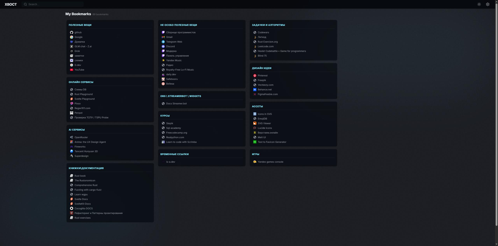
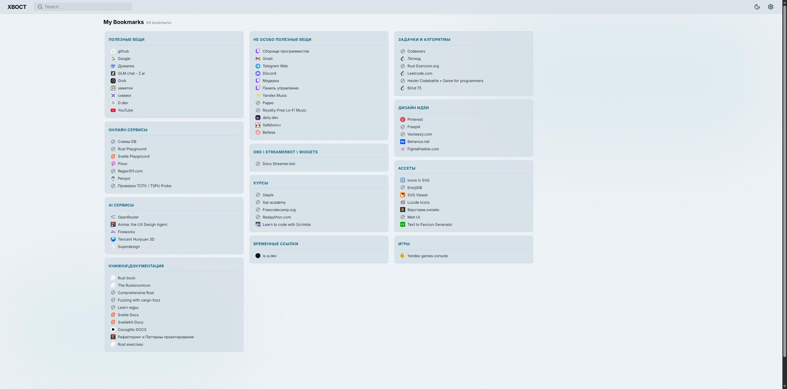

# XBOCT Page

Стартовая страница для управления закладками.

> **⚠️ Ранняя стадия разработки.** Скриншоты отражают текущее состояние приложения.

## Скриншоты

### Тёмная тема


### Светлая тема


## Возможности

- Замена стартовой страницы Chrome
- Сохранение закладок из popup
- Управление закладками

## Разработка

```bash
npm install
npm run dev      # Запуск dev сервера
npm run build    # Сборка расширения
npm run check    # Проверка типов Svelte
npm run lint     # Линтинг ESLint
npm run format   # Форматирование Prettier
```

## Структура

```
src/
├── start/      # Стартовая страница (newtab)
├── popup/      # Popup окно расширения
└── components/ # Переиспользуемые компоненты
```

## Технологии

- Svelte 5 (runes)
- TypeScript
- Vite
- CRXJS
