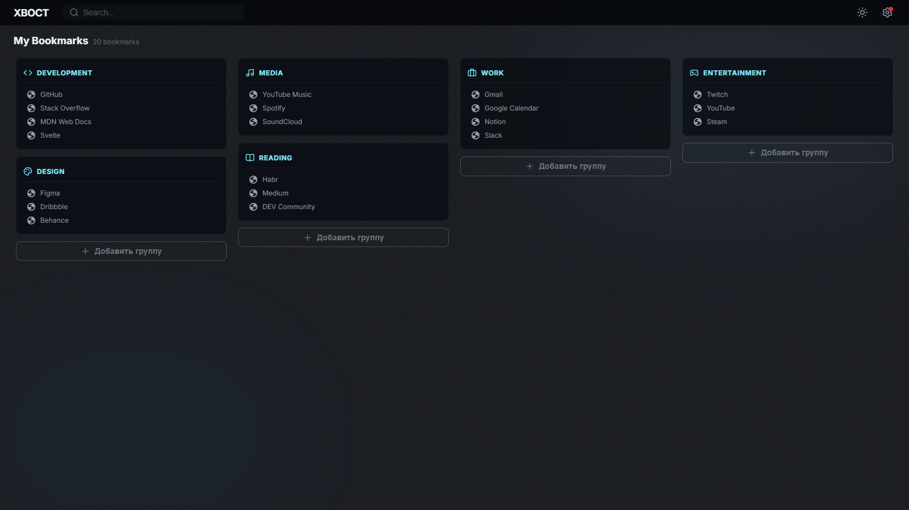
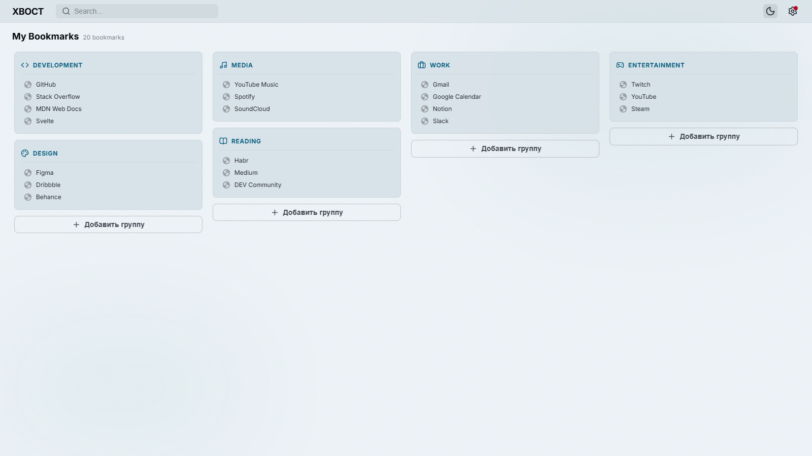

# XBOCT Page

A start page for Chrome that organizes your bookmarks into draggable groups.

[Русская версия](README_RU.md)

> **Note:** Early development stage. Screenshots reflect the current state of
> the app.

## Screenshots

### Dark theme



### Light theme



## Features

- **Bookmark groups in columns** — arrange your links into themed groups on a
  customizable start page
- **Drag & drop everything** — move groups between columns and bookmarks between
  groups, precisely where you want them
- **Quick add** — paste a URL and the title and favicon are fetched
  automatically
- **Group icons** — pick from 50+ icons to spot groups at a glance
- **Dark & light themes** — one click in the header
- **Import & export** — JSON export, import from JSON or Chrome bookmarks HTML
- **Automatic backups** — set a file once and get instant and/or daily backups,
  plus sync via your Google account
- **Search** — filter bookmarks right from the header

## Installation

### From a release (recommended)

1. Download the latest `release.zip` from
   [Releases](https://github.com/Ku6epXBOCTuK/XBOCT-page/releases)
2. Unpack it somewhere permanent (the extension loads from this folder)
3. Open `chrome://extensions` in Chrome
4. Enable **Developer mode** (top right)
5. Click **Load unpacked** and select the unpacked folder
6. Open a new tab — that's your new start page

### Updates

Replace the folder contents with the newer release and press the reload button
on `chrome://extensions`. Your bookmarks are preserved.

## Usage

### Managing groups

- **Add a group** — the "Добавить группу" (Add group) button at the bottom of
  any column
- **Move a group** — drag it by its header to any position in any column
- **Edit or delete a group** — the pencil icon or the `⋮` menu in the group
  header
- **Rename, change icon, reorder bookmarks** — all in the group edit dialog

### Managing bookmarks

- **Add by URL** — in the group edit dialog, paste a link; title and favicon
  load automatically
- **Move a bookmark** — drag it by the handle that appears on hover, inside its
  group or into another group
- **Edit / delete** — buttons in the group edit dialog

### Backups

Your bookmarks are stored in `chrome.storage.sync` and sync across devices
signed into your Google account. For extra safety, set up file backups:

1. Open **Settings** (gear icon in the header)
2. In the **Backup** section choose a file for the **instant** backup (saved on
   every change) and/or the **daily** backup
3. Point it to a cloud-synced folder (Dropbox, Google Drive, etc.) for
   off-machine copies

A red dot on the settings icon means no backup file is configured yet.

### Import / Export

In **Settings** you can export bookmarks to JSON and import from JSON or a
Chrome bookmarks HTML export. Importing replaces all current bookmarks (you'll
be asked to confirm).

## Building from source

```bash
pnpm install
pnpm run build   # output in dist/
```

See [AGENTS.md](AGENTS.md) for development guidelines.

## License

[MIT](LICENSE)
